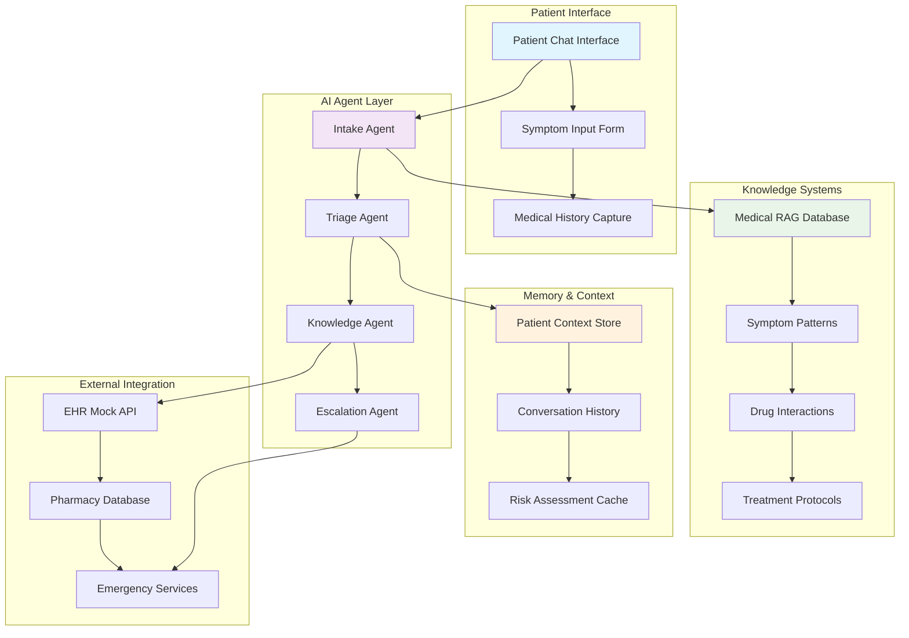
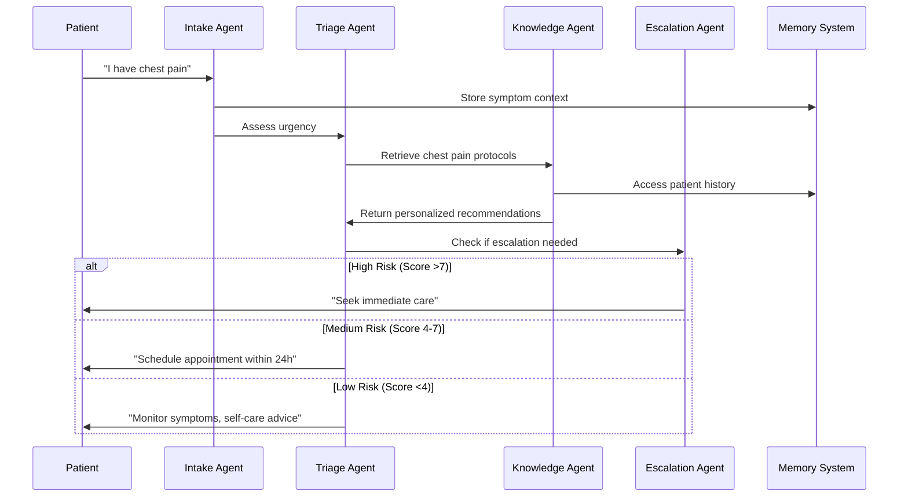
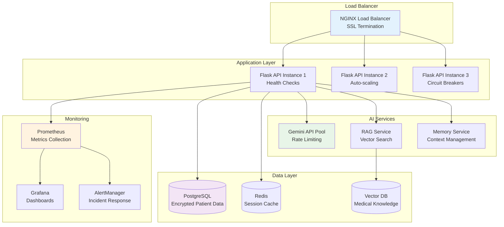

# Healthcare AI Pod: Patient Care Intelligence System
## Project Overview - Building the Future of Medical Triage

**Mission**: Create an AI-powered patient triage system that combines the latest healthcare AI trends with production-ready deployment practices.

**Industry Context**: 80% of hospitals now use AI to improve patient care and operational efficiency, while RAG systems like ChatRWD produce useful answers to 58% of medical questions (compared with 2%-10% for standard LLMs).

---

## Learning Objectives

By the end of 4 hours, each pair will have built and deployed:
- **Multi-agent healthcare system** with intelligent triage
- **RAG-powered medical knowledge base** with real-time retrieval
- **Context-aware patient conversations** with persistent memory
- **Production deployment** with HIPAA-compliant monitoring

---

## 🏗️ System Architecture



---

## 👥 User Stories & Success Criteria

### 🤒 As a Patient
| User Story | Acceptance Criteria | Technical Implementation |
|------------|-------------------|-------------------------|
| **Symptom Reporting** | "I can describe my symptoms in natural language and get intelligent follow-up questions" | Multi-turn conversation with Gemini API + custom medical prompts |
| **Risk Assessment** | "I receive a clear 1-10 urgency score with actionable next steps" | Triage agent with weighted scoring algorithm + escalation rules |
| **Medical History Integration** | "The system remembers my past conditions and medications" | Vector embeddings for patient context + conversation memory |
| **Treatment Guidance** | "I get evidence-based recommendations for my specific situation" | RAG retrieval from medical knowledge base + personalized filtering |

### 👩‍⚕️ As a Healthcare Provider
| User Story | Acceptance Criteria | Technical Implementation |
|------------|-------------------|-------------------------|
| **Patient Prioritization** | "I see patients ranked by AI-assessed urgency with supporting evidence" | Dashboard with triage scores + reasoning explanations |
| **Clinical Decision Support** | "I have access to relevant medical protocols and patient history during consultations" | Knowledge agent with real-time lookup + context injection |
| **Workload Management** | "The system handles routine inquiries and escalates complex cases appropriately" | Automated routing based on complexity scoring + human handoff |

### 🏥 As a Healthcare Administrator
| User Story | Acceptance Criteria | Technical Implementation |
|------------|-------------------|-------------------------|
| **Compliance Monitoring** | "All patient interactions are logged with HIPAA-compliant audit trails" | Encrypted logging + data governance framework |
| **Performance Analytics** | "I can track system accuracy, patient satisfaction, and operational efficiency" | Real-time monitoring dashboard + KPI tracking |

---

## Technology Stack & Infrastructure

**Deployment Environment**: AWS EC2 instances (pre-configured with Docker)
**Vector Database**: ChromaDB for medical knowledge embeddings
**Relational Database**: SQLite3 for patient data and conversation history
**AI Framework**: Gemini API for multi-agent orchestration
**Backend**: Python Flask with pre-built agent framework
**Frontend**: React.js with real-time chat components

## What You'll Receive (Instructor-Provided Foundation)

### Starter Kit Contents

#### Backend Infrastructure (`/backend`)
```python
# Flask API with pre-configured routes
├── app.py                    # Main Flask application
├── models/
│   ├── patient.py           # Patient data models with encryption
│   ├── conversation.py      # Chat history management
│   └── triage.py           # Scoring and escalation logic
├── agents/
│   ├── base_agent.py       # Agent framework with Gemini integration
│   ├── templates/          # Medical prompt templates
│   └── tools/              # External API connectors
└── config/
    ├── medical_db.json     # 500+ symptoms/treatments database
    └── hipaa_config.py     # Compliance and security settings
```

#### ⚛️ Frontend Components (`/frontend`)
```javascript
// React components for patient interface
├── src/
│   ├── components/
│   │   ├── ChatInterface.jsx      # Real-time chat with typing indicators
│   │   ├── SymptomForm.jsx       # Structured symptom input
│   │   ├── TriageDisplay.jsx     # Urgency score visualization
│   │   └── HistoryPanel.jsx      # Patient context display
│   ├── services/
│   │   ├── apiClient.js          # Backend communication
│   │   └── websocket.js          # Real-time updates
│   └── utils/
│       └── encryption.js         # Client-side data protection
```

#### 🧠 AI Agent Framework
```python
# Pre-built agent classes ready for customization
class IntakeAgent:
    """Collects patient symptoms and medical history"""
    - Natural language processing for symptom extraction
    - Follow-up question generation
    - Medical terminology standardization

class TriageAgent:
    """Assesses urgency and recommends actions"""
    - Weighted scoring algorithm (pain level, vital signs, duration)
    - Risk factor evaluation
    - Escalation threshold detection

class KnowledgeAgent:
    """Retrieves relevant medical information"""
    - Vector similarity search through medical database
    - Treatment protocol matching
    - Drug interaction checking

class EscalationAgent:
    """Manages handoffs to human providers"""
    - Provider availability checking
    - Case complexity assessment
    - Emergency service integration
```

#### 📚 Medical Knowledge Base
| Component | Contents | Format |
|-----------|----------|---------|
| **Symptoms Database** | 500+ common symptoms with severity indicators | JSON with vector embeddings |
| **Treatment Protocols** | Evidence-based care guidelines for 200+ conditions | Structured text with metadata |
| **Drug Interactions** | Medication compatibility matrix | Relational data with severity flags |
| **Escalation Rules** | Condition-specific urgency criteria | Decision trees with confidence scores |

---

## 🚀 4-Hour Implementation Sprint

### ⏰ Phase 1: Setup & Basic Chat (30 minutes)

#### 🎯 Sprint Goals
- [ ] Environment setup and API connection
- [ ] Basic patient-AI conversation flow
- [ ] Symptom collection with follow-up questions

#### Technical Setup Tasks
```bash
# Environment Setup (EC2 + Local Development)
1. SSH into provided EC2 instance: ssh -i keypair.pem ubuntu@<ec2-ip>
2. Clone starter repository: git clone <repo-url>
3. Install Python dependencies: pip install -r requirements.txt
4. Install Node dependencies: npm install
5. Initialize ChromaDB: python setup_chromadb.py
6. Initialize SQLite database: python setup_database.py
7. Configure Gemini API key in .env file
8. Test agent framework: python test_agents.py
9. Launch backend: python app.py
10. Launch frontend: npm start
```

#### 💡 AI-Assisted Development
```python
# Example: Customize the intake agent
@ai_prompt_template
def symptom_intake_prompt(patient_input):
    return f"""
    You are a medical intake specialist. A patient says: "{patient_input}"
    
    Ask ONE specific follow-up question to better understand:
    - Pain level (1-10 scale)
    - Duration of symptoms  
    - Associated symptoms
    - Any relevant medical history
    
    Be empathetic and professional. Avoid medical diagnosis.
    """
```

#### ✅ Success Metrics
- Patient can describe symptoms in natural language
- AI asks relevant follow-up questions
- Conversation context is maintained across exchanges

---

### ⏰ Phase 2: Medical Logic (30 minutes)

#### 🎯 Sprint Goals
- [ ] Implement triage scoring algorithm
- [ ] Connect to medical knowledge database
- [ ] Add drug interaction checking
- [ ] Create escalation rules for high-risk cases

#### 🛠️ Technical Implementation
```python
# Triage scoring algorithm
class TriageScorer:
    def calculate_urgency(self, symptoms, vitals, history):
        base_score = self.symptom_severity_lookup(symptoms)
        modifiers = {
            'age_factor': self.age_risk_multiplier(history.age),
            'vital_signs': self.vital_signs_assessment(vitals),
            'chronic_conditions': self.chronic_disease_impact(history),
            'pain_level': self.pain_scale_weighting(symptoms.pain)
        }
        
        final_score = min(10, base_score + sum(modifiers.values()))
        return {
            'urgency': final_score,
            'reasoning': self.generate_explanation(base_score, modifiers),
            'recommended_action': self.get_action_for_score(final_score)
        }
```

#### ChromaDB Integration Setup
```python
# Initialize ChromaDB for medical knowledge
import chromadb
from chromadb.config import Settings

class MedicalKnowledgeStore:
    def __init__(self):
        self.client = chromadb.Client(Settings(
            chroma_db_impl="duckdb+parquet",
            persist_directory="./medical_knowledge_db"
        ))
        self.collection = self.client.create_collection("medical_knowledge")
        
    def add_medical_documents(self, documents, metadatas):
        self.collection.add(
            documents=documents,
            metadatas=metadatas,
            ids=[f"doc_{i}" for i in range(len(documents))]
        )
        
    def search_medical_knowledge(self, query, n_results=5):
        return self.collection.query(
            query_texts=[query],
            n_results=n_results
        )
```

#### SQLite3 Patient Data Setup
```python
# SQLite database for patient conversations and history
import sqlite3
from datetime import datetime

class PatientDataManager:
    def __init__(self):
        self.conn = sqlite3.connect('patient_data.db', check_same_thread=False)
        self.setup_tables()
        
    def setup_tables(self):
        self.conn.execute('''
            CREATE TABLE IF NOT EXISTS patients (
                id INTEGER PRIMARY KEY,
                patient_id TEXT UNIQUE,
                medical_history TEXT,
                created_at TIMESTAMP
            )
        ''')
        
        self.conn.execute('''
            CREATE TABLE IF NOT EXISTS conversations (
                id INTEGER PRIMARY KEY,
                patient_id TEXT,
                message TEXT,
                response TEXT,
                urgency_score INTEGER,
                timestamp TIMESTAMP,
                FOREIGN KEY (patient_id) REFERENCES patients (patient_id)
            )
        ''')
        self.conn.commit()
```

#### Knowledge Integration
| Integration Point | Data Source | Processing Method |
|------------------|-------------|-------------------|
| **Symptom Lookup** | ChromaDB medical embeddings | Vector similarity search |
| **Patient History** | SQLite3 conversations table | Relational data queries |
| **Treatment Protocols** | ChromaDB clinical guidelines | RAG retrieval with ranking |
| **Drug Interactions** | SQLite3 medications table | Cross-reference checking |

#### ✅ Success Metrics
- Accurate urgency scoring (1-10 scale)
- Relevant treatment recommendations
- Proper escalation for scores >7

---

### ⏰ Phase 3: RAG + Memory + Agents (90 minutes)

#### 🎯 Sprint Goals - The Core AI Architecture
- [ ] Build medical knowledge RAG system
- [ ] Implement persistent patient memory
- [ ] Create multi-agent workflow orchestration
- [ ] Add real-time conversation context management

#### RAG Implementation with ChromaDB
```python
# Medical RAG using ChromaDB and SQLite
class MedicalRAGSystem:
    def __init__(self):
        self.vector_store = MedicalKnowledgeStore()  # ChromaDB for medical knowledge
        self.patient_db = PatientDataManager()       # SQLite for patient data
        self.clinical_embeddings = SentenceTransformer('all-MiniLM-L6-v2')
        
    def hybrid_retrieval(self, query, patient_context):
        # Combine vector search + knowledge graph + patient history
        vector_results = self.semantic_search(query)
        graph_results = self.relationship_search(query, patient_context)
        contextual_results = self.personalized_search(patient_context)
        
        return self.rank_and_merge(vector_results, graph_results, contextual_results)
```

#### 🧪 Agent Orchestration Workflow


#### 💾 Advanced Memory Architecture
AI systems with persistent memory create compound learning effects impossible in traditional platforms. Our implementation includes:

| Memory Type | Storage Method | Use Case | Retention Period |
|-------------|----------------|----------|------------------|
| **Episodic** | Vector embeddings of conversation turns | Remember breakthrough moments, patient concerns | 6 months |
| **Semantic** | Knowledge graph of medical relationships | Store learned patterns about patient's conditions | Ongoing |
| **Procedural** | Preference tracking for interaction style | Adapt communication style per patient | 1 year |
| **Working** | Session state management | Maintain context within conversation | Session only |

```python
# Memory integration example
class PatientMemoryManager:
    def update_patient_context(self, patient_id, interaction):
        # Store episodic memory
        self.episodic_store.add_interaction(patient_id, interaction)
        
        # Update semantic understanding
        extracted_conditions = self.extract_medical_entities(interaction)
        self.semantic_graph.update_patient_profile(patient_id, extracted_conditions)
        
        # Learn interaction preferences
        communication_style = self.analyze_patient_preferences(interaction)
        self.procedural_store.update_preferences(patient_id, communication_style)
        
    def get_personalized_context(self, patient_id, current_query):
        # Combine all memory types for rich context
        return {
            'history': self.episodic_store.get_relevant_interactions(patient_id, current_query),
            'conditions': self.semantic_graph.get_patient_conditions(patient_id),
            'preferences': self.procedural_store.get_communication_style(patient_id)
        }
```

#### ✅ Success Metrics
- Agents work together seamlessly
- Patient context improves recommendation quality
- Memory system provides relevant historical information

---

### Phase 4: Production Deploy on EC2 (90 minutes)

#### Sprint Goals - Enterprise-Ready Healthcare AI
- [ ] Implement HIPAA-compliant security architecture
- [ ] Deploy with comprehensive monitoring and logging
- [ ] Add performance optimization and cost management
- [ ] Create production-ready error handling and fallbacks

#### EC2 Deployment Setup
```bash
# Production deployment on EC2
# 1. Prepare application for production
sudo apt update
sudo apt install nginx python3-pip nodejs npm

# 2. Configure reverse proxy
sudo nano /etc/nginx/sites-available/healthcare-ai
# Add proxy configuration for Flask app

# 3. Set up SSL certificate
sudo apt install certbot python3-certbot-nginx
sudo certbot --nginx -d your-domain.com

# 4. Configure systemd service
sudo nano /etc/systemd/system/healthcare-ai.service
# Add service configuration

# 5. Start services
sudo systemctl enable healthcare-ai
sudo systemctl start healthcare-ai
sudo systemctl start nginx
```

#### HIPAA Compliance Framework
Data Security: Ensure all chatbot interactions are encrypted and HIPAA-compliant

```python
# Enterprise security implementation
class HIPAASecurityManager:
    def __init__(self):
        self.encryption_key = self.load_encryption_key()
        self.audit_logger = HIPAAAuditLogger()
        self.access_controller = RoleBasedAccessControl()
        
    def secure_patient_data(self, patient_data):
        # Encrypt PII and PHI
        encrypted_data = self.encrypt_sensitive_fields(patient_data)
        
        # Log access for audit trail
        self.audit_logger.log_data_access(
            user_id=current_user.id,
            data_type='patient_interaction',
            action='create',
            timestamp=datetime.utcnow()
        )
        
        return encrypted_data
        
    def role_based_access(self, user_role, requested_data):
        permissions = {
            'patient': ['own_data', 'chat_history'],
            'nurse': ['patient_data', 'triage_scores', 'treatment_protocols'],
            'doctor': ['full_access'],
            'admin': ['system_logs', 'audit_trails', 'performance_metrics']
        }
        return self.access_controller.check_permission(user_role, requested_data)
```

#### 📊 Monitoring & Observability Dashboard
In late 2024, a mid-sized American hospital integrated an AI triage solution with its electronic health record (EHR) system... drastically cut down on wait times in emergency rooms

```python
# Production monitoring setup
class HealthcareAIMonitoring:
    def __init__(self):
        self.metrics_collector = PrometheusCollector()
        self.alerting_system = PagerDutyIntegration()
        self.dashboard = GrafanaDashboard()
        
    def track_clinical_metrics(self):
        return {
            'triage_accuracy': self.calculate_triage_accuracy(),
            'patient_satisfaction': self.get_patient_feedback_scores(),
            'response_time': self.measure_ai_response_times(),
            'escalation_rate': self.calculate_escalation_percentage(),
            'system_availability': self.get_uptime_percentage()
        }
        
    def setup_alerts(self):
        self.alerting_system.add_alert(
            name="High Escalation Rate",
            condition="escalation_rate > 30%",
            action="notify_medical_director"
        )
        
        self.alerting_system.add_alert(
            name="Slow Response Time", 
            condition="avg_response_time > 3_seconds",
            action="auto_scale_resources"
        )
```

#### 🚀 Deployment Architecture


#### 💰 Cost Optimization Strategy
| Cost Center | Optimization Technique | Expected Savings |
|-------------|----------------------|------------------|
| **Gemini API Calls** | Response caching + prompt optimization | 60% reduction |
| **Vector Database** | Efficient indexing + query batching | 40% reduction |
| **Cloud Infrastructure** | Auto-scaling + spot instances | 50% reduction |
| **Storage** | Data archiving + compression | 30% reduction |

#### ✅ Production Readiness Checklist
- [ ] SSL/TLS encryption for all endpoints
- [ ] HIPAA audit logging implemented
- [ ] Auto-scaling configured for peak loads
- [ ] Health checks and monitoring dashboards active
- [ ] Error handling with graceful degradation
- [ ] Backup and disaster recovery procedures
- [ ] Performance benchmarks meeting targets (<2s response time)

---

## 🎯 Final Demo Requirements

### 🏆 Capstone Project Showcase

Each pair must demonstrate a complete patient journey:

1. **Patient Intake** (2 minutes)
   - Natural language symptom description
   - AI asks intelligent follow-up questions
   - Medical history integration

2. **AI Triage Process** (2 minutes) 
   - Real-time urgency scoring with explanations
   - RAG-powered treatment recommendations
   - Escalation decision with reasoning

3. **Production Capabilities** (1 minute)
   - Security features and compliance measures
   - Monitoring dashboard with live metrics
   - Performance optimization results

### 📊 Success Metrics for Evaluation

| Metric Category | Target | Measurement Method |
|----------------|--------|-------------------|
| **Technical Implementation** | All 4 pillars working | Live demo functionality |
| **User Experience** | Smooth conversation flow | Evaluator interaction test |
| **Clinical Accuracy** | Appropriate triage decisions | Medical professional review |
| **Production Quality** | Sub-2s response time | Performance monitoring |
| **Innovation Factor** | Creative feature additions | Peer and instructor scoring |

---

## 🌟 Bonus Challenges (For Advanced Pairs)

### 🔬 Advanced Features
- **Multi-language Support**: Real-time translation for diverse patient populations
- **Voice Interface**: Speech-to-text for hands-free patient interaction
- **Predictive Analytics**: Machine learning models for readmission risk
- **Integration APIs**: Real EHR system connections via HL7 FHIR

### 🏅 Innovation Opportunities
AI technologies are already helping doctors spot fractures, triage patients and detect early signs of disease

Consider implementing cutting-edge healthcare AI trends:
- **Ambient Listening**: Background conversation analysis for automatic note-taking
- **Synthetic Data**: Generate training data while preserving patient privacy
- **Explainable AI**: Provide detailed reasoning for all medical recommendations
- **Continuous Learning**: System improves accuracy based on provider feedback

---

## 📚 Resources & Documentation

### 🔗 Essential Links
- **Gemini API Documentation**: [ai.google.dev/docs](https://ai.google.dev/docs)
- **Healthcare RAG Best Practices**: Instructor-provided research papers
- **HIPAA Compliance Guide**: Custom implementation checklist
- **Medical Knowledge Base**: Structured symptom and treatment database

### 🆘 Getting Help
- **Technical Issues**: Raise hand for instructor assistance
- **AI Prompting**: Use provided medical prompt templates
- **Medical Accuracy**: Consult with healthcare professional evaluators
- **Deployment Problems**: Reference deployment troubleshooting guide

### 🤝 Collaboration Guidelines
- **Pair Programming**: Driver/Navigator rotation every 30 minutes
- **Code Sharing**: All teams use shared GitHub repository
- **Cross-team Learning**: Encourage knowledge sharing between pairs
- **Final Integration**: Teams demo to each other for feedback

---

## 🎉 Project Impact & Real-World Applications

This healthcare AI project mirrors real industry implementations where chatbots can improve efficiency by up to 40% and reduce readmission rates by 30%, time spent reviewing patients by up to 40%.

By completing this 4-hour sprint, you'll have built a system comparable to productions implementations at leading healthcare organizations, positioning you for roles in the rapidly growing healthcare AI sector valued at $431.05 billion by 2032.

**Ready to revolutionize healthcare with AI? Let's build the future of patient care! 🚀**